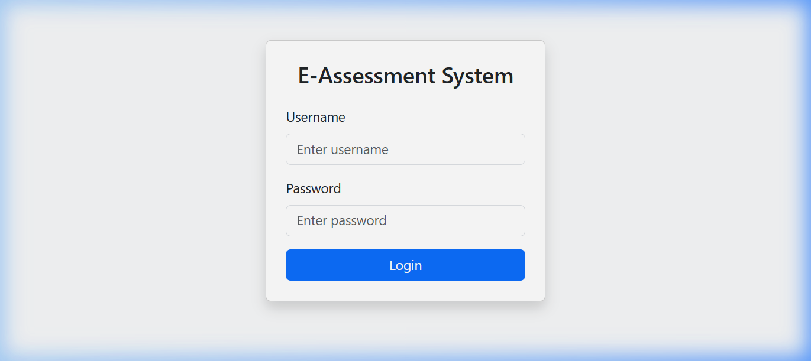
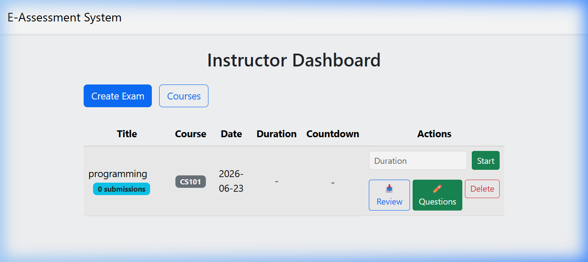
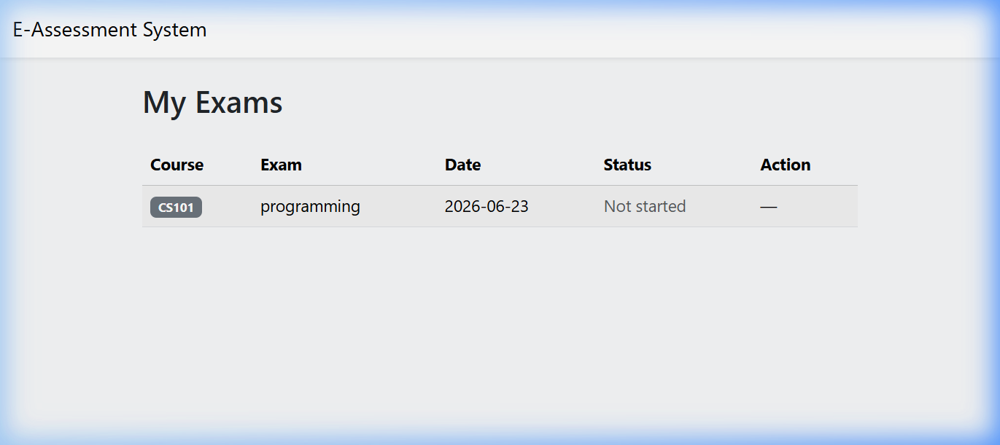
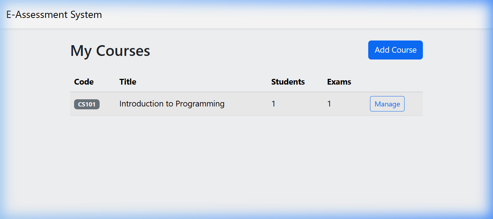

# E-Assessment System

An electronic assessment system built with **Flask** to manage exams and courses between instructors, students, and administrators.


---

## 🖼️ Screenshots

### Login Page


### Instructor Dashboard


### Student Dashboard


### Courses Page


---

## 📋 Table of Contents

- [Screenshots](#️-screenshots)
- [Prerequisites](#prerequisites)
- [Installation and Setup](#installation-and-setup)
- [Production Deployment](#production-deployment-waitress)
- [Environment Variables](#environment-variables)
- [Project Structure](#project-structure)
- [Database Schema](#database-schema)
- [Features](#features)
- [Demo Credentials](#demo-credentials)
- [Importing Students via CSV](#importing-students-via-csv)
- [Security](#security)
- [Publishing to GitHub](#publishing-to-github)

---

## Prerequisites

- Python 3.10 or higher
- pip

### Packages Used

| Package | Version | Purpose |
|--------|---------|--------|
| Flask | ≥ 3.0 | Core web framework |
| Werkzeug | ≥ 3.0 | Password hashing and file handling |
| Flask-WTF | ≥ 1.2 | CSRF protection for forms |
| Jinja2 | ≥ 3.1 | HTML templating engine |
| ReportLab | ≥ 4.0 | PDF generation for grade reports |
| Waitress | ≥ 3.0 | Windows-compatible production WSGI server |

---

## Installation and Setup

```bash
# 1. Create a virtual environment (recommended)
python -m venv .venv

# Activate the virtual environment
.venv\Scripts\activate        # Windows
# source .venv/bin/activate   # Linux/macOS

# 2. Install required packages
pip install -r requirements.txt

# 3. Initialize the database (first time only)
python scripts/init_db.py

# 4. Run the application in development mode
python app.py
```

Open your browser at: **http://localhost:5000**

> **Note:** If the database already exists and you only want to apply migrations:
> ```bash
> python scripts/migrate_db.py
> ```

---

## Production Deployment (Waitress)

```bash
# 1. Copy and modify the environment file
copy .env.example .env        # Windows
# cp .env.example .env        # Linux/macOS

# 2. In the .env file — very important before deployment:
#    SECRET_KEY=a-long-secure-random-string
#    FLASK_DEBUG=0
#    SESSION_COOKIE_SECURE=1   # Only when using HTTPS

# 3. Run the production server
python run_production.py
```

> **Windows:** Waitress is the recommended option for production on Windows.
> **Linux:** You can use Gunicorn instead via: `gunicorn wsgi:app`

> **Deployment Warning:** Demo accounts (`1234` / `admin123`) are for development only. Make sure to change or delete them before public deployment.

---

## Environment Variables

Variables are loaded automatically from the `.env` file in the project root.

| Variable | Description | Default Value |
|---------|-------|--------------------|
| `SECRET_KEY` | Flask session encryption key | Insecure value — **Mandatory to change in production** |
| `FLASK_DEBUG` | Debug mode (`1` = enabled, `0` = disabled) | `1` |
| `HOST` | IP address to listen on | `0.0.0.0` |
| `PORT` | Port number | `5000` |
| `SESSION_COOKIE_SECURE` | Enable secure cookies over HTTPS (`1` or `0`) | `0` |
| `DATABASE` | Database file path | `db.sqlite3` |
| `UPLOAD_FOLDER` | Directory to save student submissions | `submissions` |
| `QUESTION_IMG_FOLDER` | Directory for question images | `question_images` |

---

## Project Structure

```
E-Assessment System/
│
├── app.py                   # Entry point — Development mode
├── run_production.py        # Production server (Waitress)
├── wsgi.py                  # WSGI interface for deployment behind Nginx/Apache
├── config.py                # Application settings and environment variables
├── db.py                    # SQLite database connection
├── decorators.py            # Route protection (Authentication / Role-based access)
├── utils.py                 # Shared helper functions
├── mcq.py                   # Multiple Choice Questions (MCQ) logic
├── file_access.py           # Protected file access control
├── requirements.txt         # Required packages list
├── .env.example             # Template for environment variables
│
├── routes/                  # App routes (Blueprints)
│   ├── auth.py              # Login, logout, and redirection
│   ├── instructor.py        # Exam, question, and grading management
│   ├── student.py           # View exams and submit answers
│   ├── admin.py             # User management (System Administrator)
│   ├── courses.py           # Course management and enrollment
│   └── files.py             # Secure file download handler
│
├── templates/               # HTML templates (Jinja2)
│   ├── base.html            # Shared base template
│   ├── login.html           # Login page
│   ├── instructor_dashboard.html
│   ├── student_dashboard.html
│   ├── admin_dashboard.html
│   ├── create_exam.html
│   ├── add_questions.html
│   ├── submit_exam.html
│   ├── view_submissions.html
│   ├── student_result.html
│   ├── course_detail.html
│   └── ...
│
├── scripts/
│   ├── init_db.py           # Initialize database from scratch
│   └── migrate_db.py        # Apply migrations to an existing database
│
├── static/                  # Static files (CSS, JS, images)
├── submissions/             # Student submission files (protected)
└── question_images/         # Uploaded question images
```

---

## Database Schema

The system uses **SQLite** with Foreign Key constraints enabled.

### Main Tables

| Table | Description |
|--------|--------|
| `users` | Users (Students, Instructors, Administrators) |
| `courses` | Academic courses |
| `enrollments` | Student course enrollments |
| `exams` | Exams with schedules and duration |
| `questions` | Exam questions (File upload / MCQ) |
| `submissions` | Student submissions and grades |
| `mcq_answers` | Student answers for MCQ questions |

---

## Features

### 👨‍🏫 Instructor
- Create and manage academic courses.
- Create exams and link them to a specific course.
- **Automated Exam Scheduling** by setting a scheduled start time.
- Add questions in two formats:
  - **File:** Upload question sheets with an optional helper image.
  - **MCQ:** Multiple Choice Questions with immediate auto-grading.
- Start exams manually with a defined duration in minutes.
- End exams at any time.
- Review student submissions, assign grades, and write feedback.
- **Export grade reports to PDF**.
- Import student lists in bulk via CSV.

### 👨‍🎓 Student
- View available exams associated with enrolled courses.
- **Real-time countdown timer** showing remaining time during active exams.
- Upload submission files with extension validation.
- Answer MCQ questions directly in the interface.
- **View grades and feedback** after grading is complete.

### 🔧 System Administrator (Admin)
- Create, modify, and delete user accounts.
- Assign roles to users (Student / Instructor / Admin).

---

## Demo Credentials

> These credentials are for development and testing only — **Do not use them in production**.

| User | Password | Role |
|------|----------|------|
| `instructor1` | `1234` | Instructor |
| `student1` | `1234` | Student |
| `admin1` | `admin123` | System Administrator |

These accounts are created automatically when you run `scripts/init_db.py`.

---

## Importing Students via CSV

Instructors can import lists of students at once using a CSV file with the following format:

```csv
username,full_name,password
student2,Ahmed Ali,1234
student3,Sara Hassan,secure_pass
student4,Mohammed Omar,
```

**Rules:**
- `username` column is **required** and must be unique.
- `full_name` column is optional.
- If `password` is left empty, the default password specified in the import form will be used.

---

## Security

| Feature | Details |
|--------|----------|
| **Password Hashing** | Uses `werkzeug.security` for hashing and verification (PBKDF2-SHA256) |
| **CSRF Protection** | Uses `Flask-WTF CSRFProtect` on all forms |
| **Secure Queries** | Employs Parameterized Queries to prevent SQL Injection |
| **File Protection** | Blocks direct public access to `/static/uploads/` directory via `before_request` handler |
| **Role-based Access** | Enforces complete segregation between Instructor, Student, and Admin paths using custom decorators |
| **Cookie Flags** | `HttpOnly=True`, `SameSite=Lax`, and `Secure` cookie support over HTTPS |
| **File Verification** | Validates uploaded student files against an allowed extensions whitelist |

---

## Publishing to GitHub

The project is pre-configured for deployment. The following files are **not pushed** automatically (included in `.gitignore`):
- `.venv/` directory
- `db.sqlite3` database file
- `.env` secret configuration file
- Student submissions in `submissions/`

```bash
git init
git add .
git commit -m "Initial commit: E-Assessment System"
git branch -M main
git remote add origin https://github.com/YOUR_USERNAME/e-assessment-system.git
git push -u origin main
```

---

## 📄 License

This project is licensed under the [MIT License](LICENSE).
